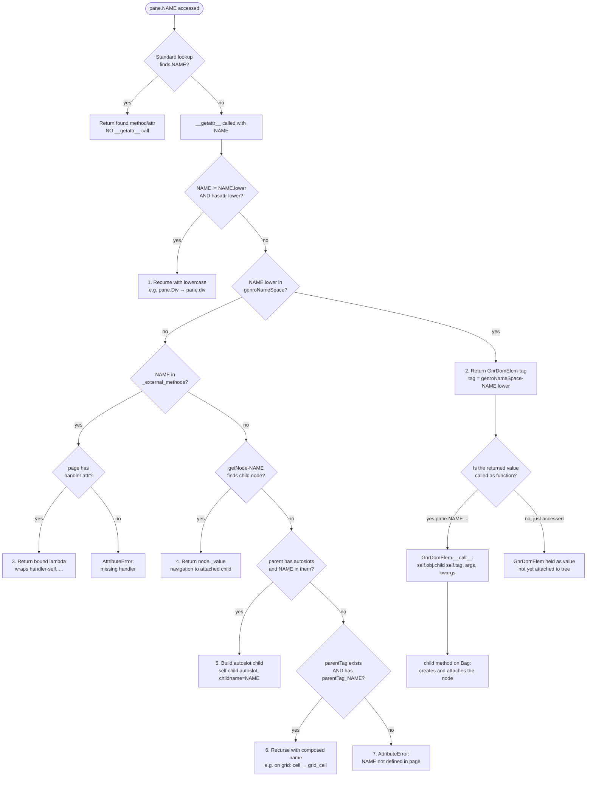
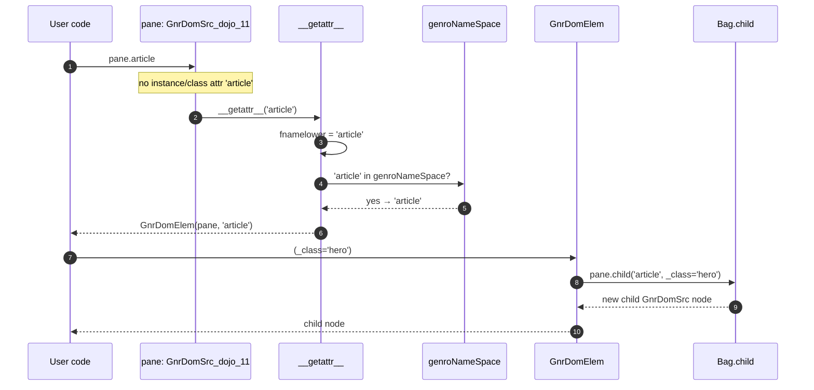
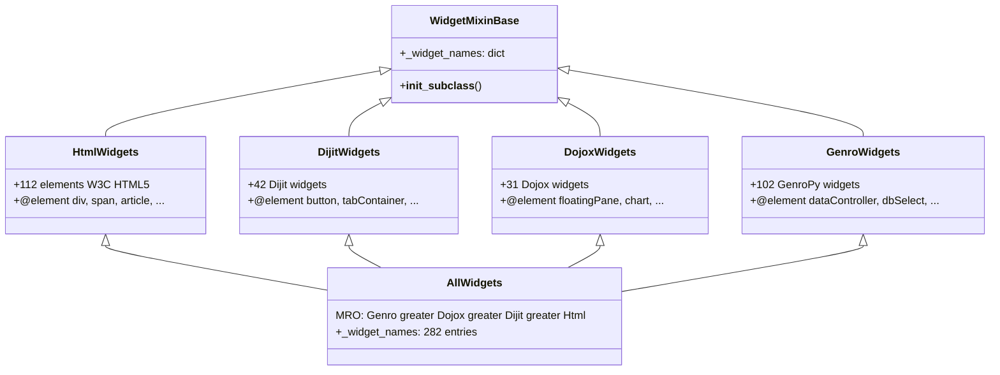

# `gnrwebstruct` — GenroPy web struct package

The `gnrwebstruct` package is the building surface for every GenroPy
web page. When a page resource writes `pane.borderContainer(...)` or
`pane.dataController(...)`, it is talking to this package — `GnrDomSrc`
intercepts the access, looks up the widget in a declarative catalog
(`AllWidgets._widget_names`), and grows the page tree as a `Bag` of
`GnrStructData` nodes. That tree is then serialized to XML and shipped
to the browser, where the JS handler registry turns each tag into a
Dijit/Dojox/Genro widget instance.

The package therefore sits between two worlds:

- **Above it** — page resources, components, batch actions, and
  framework primitives (`gnrbaseclasses`, `gnrwebpage`) that drive the
  DSL `pane.NAME(...)`.
- **Below it** — `gnr.core.gnrstructures.GnrStructData` and
  `gnr.core.gnrbag.Bag`, which provide the underlying tree storage and
  XML serialization.

## Public surface

Re-exported from `__init__.py`:

| Symbol | Defined in | Purpose |
|---|---|---|
| `GnrDomSrc` | `base.py` | Abstract dispatcher; owns `__getattr__`, `child`, `makeRoot`, `_external_methods` |
| `GnrDomSrc_dojo_11` | `dojo11.py` | Concrete dispatcher used in production; sets `genroNameSpace = AllWidgets._widget_names` |
| `GnrDomSrc_dojo_20` | `dojo20.py` | Placeholder subclass for the future Dojo 2.0 migration |
| `GnrDomElem` | `base.py` | Callable wrapper that turns a namespace hit into a `self.child(tag, ...)` call |
| `GnrDomSrcError` | `base.py` | Exception type for struct construction errors |
| `GnrFormBuilder` | `formbuilder.py` | Builds tabular forms from a database table |
| `GnrGridStruct` | `gridstruct.py` | Builds grid column structures |
| `struct_method` | `base.py` | Decorator that registers a user-defined widget into `_external_methods` |
| `StructMethodError` | `base.py` | Exception raised on `@struct_method` collisions |
| `cellFromField` | `_helpers.py` | Builds cell kwargs from a `dbtable` field — used by grid/print builders |

## Package layout

```
gnrwebstruct/
├── __init__.py          public re-exports
├── base.py              GnrDomElem, GnrDomSrc, __getattr__, child, @struct_method
├── dojo11.py            GnrDomSrc_dojo_11 — sets genroNameSpace = AllWidgets._widget_names
├── dojo20.py            GnrDomSrc_dojo_20 — empty subclass stub
├── _helpers.py          cellFromField, _selected_defaultFrom (used by DSL builders)
├── formbuilder.py       GnrFormBuilder (tabular form constructor)
├── gridstruct.py        GnrGridStruct (grid column constructor)
└── _widgets/            declarative widget catalog (package-private)
    ├── __init__.py      @element decorator, WidgetMixinBase, AllWidgets
    ├── html.py          HtmlWidgets — 112 W3C HTML5 elements
    ├── dijit.py         DijitWidgets — 42 Dijit widgets
    ├── dojox.py         DojoxWidgets — 31 Dojox widgets
    └── genro.py         GenroWidgets — 102 native GenroPy widgets
```

Total widget catalog: 282 entries after cross-dialect collision merge.

## Core concept: declarative widgets + `__getattr__` dispatch

A widget is two things:

1. **A declaration** in one of the four mixins under `_widgets/`,
   marked with the `@element` decorator. The decorator records the
   widget name on the function and `WidgetMixinBase.__init_subclass__`
   collects them into `_widget_names`. `AllWidgets` composes the four
   mixins through MRO so cross-dialect collisions resolve as
   *leftmost wins* (Genro > Dojox > Dijit > Html).

2. **A dispatch rule** in `GnrDomSrc.__getattr__`. When user code
   accesses `pane.borderContainer`, Python's standard attribute lookup
   fails (no method by that name on the class) and falls through to
   `__getattr__`, which finds `bordercontainer` in `genroNameSpace`,
   builds a `GnrDomElem(self, 'borderContainer')`, and returns it.
   Calling it (`pane.borderContainer(...)`) then runs
   `GnrDomElem.__call__`, which delegates to `self.child(tag, ...)`.

This separation — *what widgets exist* (the mixin catalog) vs. *how a
widget call is dispatched* (`__getattr__`) — is the architectural
backbone of the package.

## How `__getattr__` dispatches

The full method in `base.py`:

```python
def __getattr__(self, fname):
    fnamelower = fname.lower()
    if (fname != fnamelower) and hasattr(self, fnamelower):
        return getattr(self, fnamelower)                          # (1)
    if fnamelower in self.genroNameSpace:
        return GnrDomElem(self, self.genroNameSpace[fnamelower])  # (2)
    if fname in self._external_methods:
        method_name = self._external_methods[fname]
        handler = getattr(self.page, method_name, None)
        if handler is None:
            raise AttributeError(...)
        return lambda *args, **kwargs: handler(self, *args, **kwargs)  # (3)
    attachnode = self.getNode(fname)
    if attachnode:
        return attachnode._value                                  # (4)
    autoslots = self._parentNode.attr.get('autoslots')
    if autoslots and fname in autoslots.split(','):
        return self.child('autoslot', childname=fname)            # (5)
    parentTag = self._parentNode.attr.get('tag', '').lower()
    if parentTag and not fnamelower.startswith(parentTag):
        subtag = ('%s_%s' % (parentTag, fname)).lower()
        if hasattr(self, subtag):
            return getattr(self, subtag)                          # (6)
    raise AttributeError(...)                                     # (7)
```

`__getattr__` is invoked **only when standard lookup fails** — class
hierarchy is searched first, so explicit methods like `def div(...)`
short-circuit the dispatch. The numbered branches are the seven
fallback steps.

### Dispatch flowchart



### Walk-through by branch

**Branch (1) — case-insensitive retry.** `pane.Div(_class='wrap')`
finds `div` as a lowercase explicit method (because `base.py` defines
`def div(...)`); the call is forwarded there. The recursion is bounded:
on the inner call `fname == fnamelower` and branch (1) is skipped.

**Branch (2) — namespace hit.** The most common path.
`pane.borderContainer(design='headline')` finds `bordercontainer` in
`genroNameSpace` and returns `GnrDomElem(pane, 'borderContainer')`. The
immediate `(...)` call invokes `GnrDomElem.__call__`, which delegates
to `pane.child('borderContainer', design='headline')`. The tag in the
namespace can be camelCase (`borderContainer`) because mixin method
names follow PEP 8 in the Dojox dialect; the JS client lowercases tags
before handler dispatch, so it is wire-format only.

**Branch (3) — `@struct_method`.** A page-level widget extension:

```python
@struct_method
def my_widget_impl(struct, *args, **kwargs):
    return struct.child('div', _class='custom', **kwargs)

# Anywhere a page resource has the function in its namespace:
pane.widgetImpl(foo='bar')
```

The decorator strips the leading `my_` prefix (`_` rule) and registers
`{'widgetImpl': 'my_widget_impl'}` in `_external_methods`. At dispatch
time, `__getattr__` resolves `widgetImpl` to the handler `my_widget_impl`
on the page object and returns a closure that re-injects `pane` as
first argument.

**Branch (4) — attached named node.** Once a child has been created
with `childname='foo'`, it becomes navigable via dotted access:

```python
pane.formstore(childname='fs')
pane.fs.handler('save', ...)   # branch (4) on .fs
```

**Branch (5) — autoslot.** A frame container can declare named slots
via `autoslots='top,left,center,right'`. Accessing `frame.center.div(...)`
auto-creates the `center` slot child.

**Branch (6) — `parentTag_subtag` convention.** When you write
`grid.cell(...)` from inside a `grid` node, the parent tag is `grid`,
so `__getattr__` retries the lookup with the composed name `grid_cell`
and finds `def grid_cell(...)` on the class. This is how widget
families like `multibutton_item`, `quickgrid_column`, and
`formstore_handler` are dispatched without polluting the global
namespace.

**Branch (7) — give up.** All other branches failed:
`AttributeError("'X' is not defined in page 'Y' — check py_requires")`.
The error name in the page filepath is the hint to debug.

### End-to-end sequence



## The `@element` decorator and `AllWidgets`

`@element` lives in `_widgets/__init__.py` and supports three forms:

```python
@element
def my_widget(self): ...                      # tag = 'my_widget'

@element()
def article(self): ...                        # tag = 'article'

@element(name='del', sub_tags='ins,del')
def del_(self): ...                           # tag = 'del' (Python keyword workaround)
```

It stores `_widget_tag` on the decorated function (and `_widget_metadata`
if extra kwargs are passed). `WidgetMixinBase.__init_subclass__` walks
the class body when each dialect mixin is defined, picks up every
decorated method, and populates `_widget_names` — a `{lowercase: tag}`
dict.

`AllWidgets` composes the four dialect mixins:



### Cross-dialect collisions

Five widget names appear in two dialects each. The MRO
`(Genro, Dojox, Dijit, Html)` resolves them deterministically:

| Name | Dialects | Winner | Reason |
|---|---|---|---|
| `button` | Html, Dijit | Dijit | Dijit is leftmost between the two |
| `dialog` | Html, Dijit | Dijit | same |
| `menu` | Html, Dijit | Dijit | same |
| `textarea` | Html, Dijit | Dijit | same |
| `script` | Html, Genro | Genro | Genro is leftmost overall |

The MRO order encodes the historical policy: *Dojo widgets win over
raw HTML elements when their names collide; native GenroPy widgets win
over everything*.

### Today: `AllWidgets._widget_names` is a catalog, not a superclass

`GnrDomSrc_dojo_11` consumes the catalog through

```python
genroNameSpace = AllWidgets._widget_names
```

It does **not** inherit from `AllWidgets`. Mixin methods (the decorated
`@element` functions) are never called — only their names matter. This
keeps the dispatch contract identical to the pre-#906 design (a flat
dict lookup) while making the catalog declarative.

A future refactor (open item below) would promote `AllWidgets` to a
real superclass of `GnrDomSrc_dojo_11`, allowing widget bodies to live
in the same mixin as their `@element` declaration.

## The `@struct_method` decorator

`@struct_method` is the **user-facing** extension point: any page
resource or component can register a new widget into the dispatch
catalog without modifying framework code.

```python
@struct_method
def myWidget(struct, *args, **kwargs):
    return struct.child('div', _class='custom', **kwargs)

# Usage:
pane.myWidget(foo='bar')
```

Three call forms:

| Form | Registered name | Function name | Notes |
|---|---|---|---|
| `@struct_method` (bare, no underscore) | `myWidget` | `myWidget` | Identity |
| `@struct_method` (bare, with `_`) | `foo` | `iv_foo` | Prefix before first `_` stripped |
| `@struct_method('bar')` | `bar` | `anything` | Explicit name |

Behind the scenes the decorator populates `GnrDomSrc._external_methods`,
a class-level (i.e. **process-global**) dict. Registering two
struct methods with the same name but different underlying functions
raises `StructMethodError`. The test suite uses an autouse fixture
(`_isolate_external_methods` in `tests/web/gnrwebstruct_test.py`) to
backup and restore the dict between tests.

### `@element` vs `@struct_method`

|  | `@element` | `@struct_method` |
|---|---|---|
| Audience | Framework maintainers | Application developers |
| Lives in | `_widgets/*.py` mixin | Page resource / component |
| Registry | `_widget_names` → `genroNameSpace` | `_external_methods` |
| Dispatch branch | (2) namespace hit | (3) external method |
| Body executed | No (today — see open items) | Yes, with `pane` as first arg |
| Scope | Global widget vocabulary | Application-local extension |

## Other public classes

### `GnrFormBuilder`

Tabular form builder. Driven by `lblpos` (`L`/`T` for label position),
`byColumn` (column-major flow), `cols`/`colswidth` (geometry), and
optional `dbtable` (auto-fill from a database table schema). Each
`place(**fieldpars)` call places one field; `br()` advances to the next
row. Constructed from inside a `formbuilder` widget via the DSL
`pane.formbuilder(...).place(...)`.

### `GnrGridStruct`

Subclass of `GnrStructData` used to declare grid column structures. A
page calls `GnrGridStruct.makeRoot(page, maintable=...)` to obtain a
root, then composes the grid via DSL methods (`view`, `cell`, etc.).
Pairs naturally with `cellFromField`, which derives column kwargs
(`dtype`, `dfltwidth`, `values`, permission flags) from a column object
in the bound `dbtable`.

## Tests

Two suites under `gnrpy/tests/web/`:

- `widgets_test.py` (25 tests) — class-level coverage of the
  declarative catalog: decorator semantics, `WidgetMixinBase`
  collection, per-dialect cardinality, `AllWidgets` composition,
  collision resolution.
- `gnrwebstruct_test.py` (17 tests) — `@struct_method` registration,
  `genroNameSpace` snapshot, `__getattr__` fallback ladder, root
  construction.

Both suites are class-level / unit-level. End-to-end rendering tests
(building a real form/grid, serializing, asserting on XML output) are
intentionally deferred to live smoke testing on a running instance —
they have higher signal in the browser than in pytest.

## Open architectural items

The current package design leaves three follow-up refactors on the
table. Each is independent and can be tackled in its own PR.

1. **Trivial wrapper removal.** Sixteen methods in `base.py:701-758`
   (`h1`–`h6`, `li`, `td`, `th`, `span`, `pre`, `div`, `style`,
   `details`, `summary`, `a`, `dt`, `option`, `caption`) are pure
   passthroughs: `def NAME(self, childcontent=None, **kwargs):
   return self.child('NAME', ...)`. Branch (2) of `__getattr__`
   already covers them; the explicit methods are redundant. Removing
   them shrinks `base.py` by ~60 lines and unifies the dispatch path
   for plain HTML tags.

2. **Co-locate widget bodies with `@element` declarations.** Today the
   declaration (`@element def flexbox(self): ...` in
   `_widgets/genro.py`) and the implementation (75-line `def flexbox(...)`
   in `base.py`) live in different files. Promoting `AllWidgets` from
   *catalog holder* to *real superclass* of `GnrDomSrc_dojo_11` lets
   each mixin own both the declaration and the body of its widgets.
   Affects:
   - Type B helpers (~10-15 methods)
   - Type C composite-widget builders (`flexbox`, `gridbox`,
     `expandbox`, `frameform`, `formstore`, `selectionStore`,
     `bagStore`, `paletteGrid`, `includedview` family — 10+ methods)
   - Type D `parentTag_subtag` families (`multibutton_*`,
     `quickgrid_*`, `formstore_handler*`, `googlechart_*`,
     `includedview_*` — 15+ methods, organized per parent widget)

   This is the largest of the three, and likely worth splitting per
   widget family to keep diffs reviewable.

3. **Rename `_external_methods` → `_struct_methods`.** The runtime
   error message and the decorator name already use "struct method"
   as the user-facing term. The internal dict is the only place
   "external method" still appears. An 11-line rename inside the
   package; no caller outside `gnrwebstruct/` references the dict
   directly.

## Trivia for future maintainers

- The dispatch contract has been stable since GenroPy 0.7. The PR
  history of the package is mostly refinement of *how* widgets are
  declared (hardcoded lists → mixin catalog), not *how* they are
  dispatched (`__getattr__` has barely changed).
- `dojo20.py` is an empty subclass kept as a forward-compatibility
  hook. The migration to Dojo 2.0 was deferred indefinitely; the
  stub exists so import paths and isinstance checks against
  `GnrDomSrc_dojo_20` continue to resolve.
- `hasattr(self, fnamelower)` in branch (1) can re-enter
  `__getattr__` itself. The recursion is bounded because the inner
  call has `fname == fnamelower`, which skips branch (1) and either
  finds a namespace hit (returns True) or raises (returns False).
